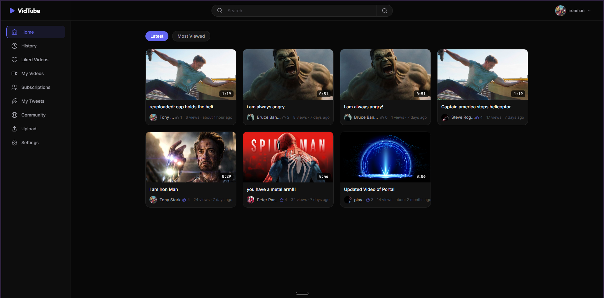
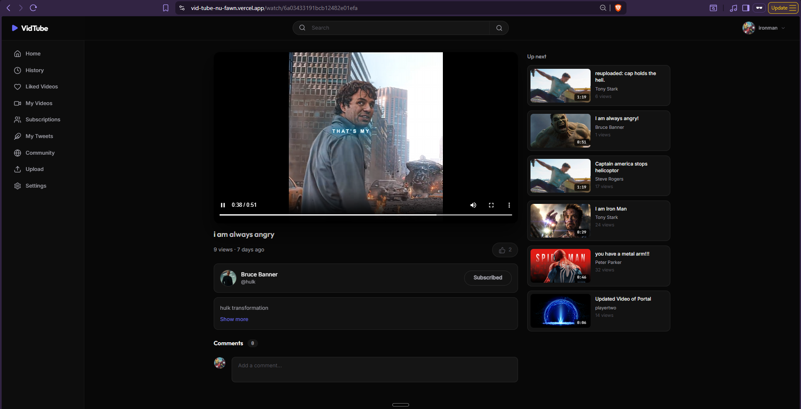
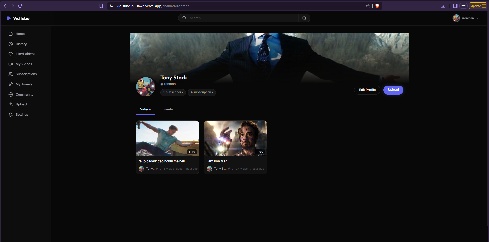
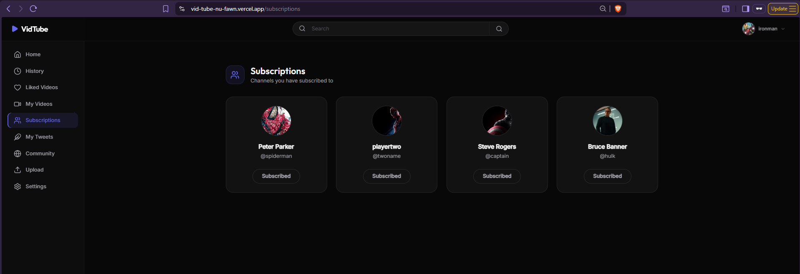
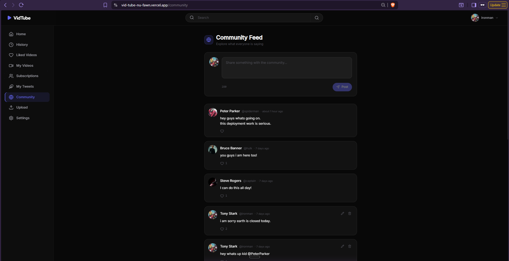

<p align="center">
  
  
  
  
  
  
  
</p>

# 🎬 VidTube

A full-stack video sharing platform built from the ground up — featuring video uploads, channel subscriptions, likes, comments, tweets, and a sleek glassmorphic dark UI.

---

## 🌐 Live Demo

- **Frontend (Vercel)**: [vid-tube-nu-fawn.vercel.app](https://vid-tube-nu-fawn.vercel.app)
- **Backend (Railway)**: [vidtube-backend-production.up.railway.app](https://vidtube-backend-production.up.railway.app)

*(Note: The backend is hosted on Railway. Initial requests may take 30-60 seconds if the server is waking up from sleep. Please be patient!)*

---

## ✨ Features

- **🔐 Authentication** — Secure JWT-based login & registration with HttpOnly cookies and automatic token refresh
- **📹 Video Upload & Management** — Upload videos with thumbnails via Cloudinary, edit metadata, toggle publish status, or delete
- **▶️ Video Playback** — Watch videos with a polished HTML5 player, view counts, and like interactions
- **💬 Comments** — Add, edit, and delete comments on videos and tweets with real-time updates
- **❤️ Likes** — Like/unlike videos, comments, and tweets with instant UI feedback
- **📢 Tweets** — Post short-form text updates on your channel for community engagement
- **👤 Channel Profiles** — Dedicated channel pages with cover images, avatars, subscriber counts, and tabbed content
- **🔍 Search & Sort** — Filter the home feed by search query, sort by date or views
- **📚 Watch History** — Automatically tracked history of watched videos
- **💾 Liked Videos** — Curated collection of all your liked videos
- **⚙️ Account Settings** — Update profile details, change password, swap avatar or cover image
- **📱 Responsive Design** — Fully responsive glassmorphic dark UI that works across desktop and mobile
- **🔄 Optimistic UI** — Instant feedback on likes, comments, and subscriptions before server confirmation

---

## 🛠️ Tech Stack

| Frontend | Backend |
|----------|---------|
| React 18 | Node.js |
| Vite | Express.js |
| Tailwind CSS v3 | MongoDB + Mongoose |
| Zustand (state management) | JWT (access + refresh tokens) |
| React Router v6 | Bcrypt (password hashing) |
| React Hook Form | Cloudinary (media storage) |
| Axios | Multer (file uploads) |
| Lucide React (icons) | Cookie-Parser |
| date-fns (date formatting) | CORS |
| Inter + Outfit + JetBrains Mono (fonts) | Aggregation Pipelines |

---

## 📸 Screenshots

> *Screenshots will be added after final UI polish.*

### Home Feed


### Watch Page


### Channel Page
  

### Subscriptions Page


### Community Tweets Page


---

## 🚀 Getting Started Locally

### Prerequisites

- **Node.js** v18+ — [Download](https://nodejs.org/)
- **MongoDB** — local instance or [MongoDB Atlas](https://www.mongodb.com/atlas)
- **Cloudinary Account** — [Sign up free](https://cloudinary.com/)
- **Git** — [Download](https://git-scm.com/)

### Installation

1. **Clone the repository**
   ```bash
   git clone https://github.com/vivekdhapa/vidTube.git
   cd vidTube
   ```

2. **Install backend dependencies**
   ```bash
   cd backend
   npm install
   ```

3. **Install frontend dependencies**
   ```bash
   cd ../frontend
   npm install
   ```

4. **Set up environment variables**

   Create a `.env` file inside the `backend/` directory (see [Environment Variables](#-environment-variables) below) and `.env.local` inside the `frontend/` directory if needed for local API paths.

5. **Start the backend server**
   ```bash
   cd backend
   npm run dev
   ```
   Backend will run on `http://localhost:8000`

6. **Start the frontend dev server** (in a new terminal)
   ```bash
   cd frontend
   npm run dev
   ```
   Frontend will run on `http://localhost:5173`

---

## 🔑 Environment Variables

Create a `.env` file in the `backend/` directory with the following variables:

```env
PORT=8000
MONGODB_URI=mongodb+srv://<username>:<password>@cluster.mongodb.net/vidtube
CORS_ORIGIN=http://localhost:5173

ACCESS_TOKEN_SECRET=your-access-token-secret
ACCESS_TOKEN_EXPIRY=1d

REFRESH_TOKEN_SECRET=your-refresh-token-secret
REFRESH_TOKEN_EXPIRY=10d

CLOUDINARY_CLOUD_NAME=your-cloud-name
CLOUDINARY_API_KEY=your-api-key
CLOUDINARY_API_SECRET=your-api-secret
```

> ⚠️ **Never commit your `.env` file.** Make sure it's listed in `.gitignore`.

---

## 📡 API Reference

Base URL: `http://localhost:8000/api/v1` *(Locally)* or `https://vidtube-backend-production.up.railway.app/api/v1` *(Production)*

### Auth / Users — `/users`

| Method | Endpoint | Description |
|--------|----------|-------------|
| `POST` | `/register` | Register a new user (multipart: avatar, coverImage) |
| `POST` | `/login` | Login with email/username + password |
| `POST` | `/logout` | Logout (clears cookies) |
| `POST` | `/refresh-token` | Refresh access token |
| `GET` | `/current-user` | Get authenticated user's profile |
| `PATCH` | `/update-account` | Update fullname & email |
| `PATCH` | `/avatar` | Update avatar image |
| `PATCH` | `/cover-image` | Update cover image |
| `POST` | `/change-password` | Change password |
| `GET` | `/channel/:username` | Get channel profile & stats |
| `GET` | `/history` | Get watch history |

### Videos — `/videos`

| Method | Endpoint | Description |
|--------|----------|-------------|
| `GET` | `/` | List all videos (paginated, searchable, sortable) |
| `GET` | `/my-videos` | Get current user's videos |
| `GET` | `/:username` | Get videos by channel username |
| `GET` | `/:videoId` | Get single video details |
| `POST` | `/publish` | Upload a new video (multipart) |
| `PATCH` | `/:videoId` | Update video metadata |
| `DELETE` | `/:videoId` | Delete a video |
| `PATCH` | `/:videoId/toggle-publish` | Toggle publish status |

### Comments — `/comments`

| Method | Endpoint | Description |
|--------|----------|-------------|
| `POST` | `/video/:videoId` | Add comment to a video |
| `POST` | `/tweet/:tweetId` | Add comment to a tweet |
| `GET` | `/video-comments/:videoId` | Get video comments (paginated) |
| `PATCH` | `/update/:commentId` | Edit a comment |
| `DELETE` | `/delete/:commentId` | Delete a comment |

### Likes — `/likes`

| Method | Endpoint | Description |
|--------|----------|-------------|
| `POST` | `/video/:videoId` | Toggle like on a video |
| `POST` | `/comment/:commentId` | Toggle like on a comment |
| `POST` | `/tweet/:tweetId` | Toggle like on a tweet |
| `GET` | `/videos` | Get all liked videos |

### Tweets — `/tweets`

| Method | Endpoint | Description |
|--------|----------|-------------|
| `POST` | `/create-tweet` | Create a new tweet |
| `GET` | `/user-tweets/:username` | Get tweets by username |
| `PATCH` | `/update/:tweetId` | Edit a tweet |
| `DELETE` | `/delete/:tweetId` | Delete a tweet |

---

## 🧑‍💻 Author

**Vivek Dhapa**

- GitHub: [@vivekdhapa](https://github.com/vivekdhapa)

---

<p align="center">
  Made with lots of caffeine ☕
</p>
